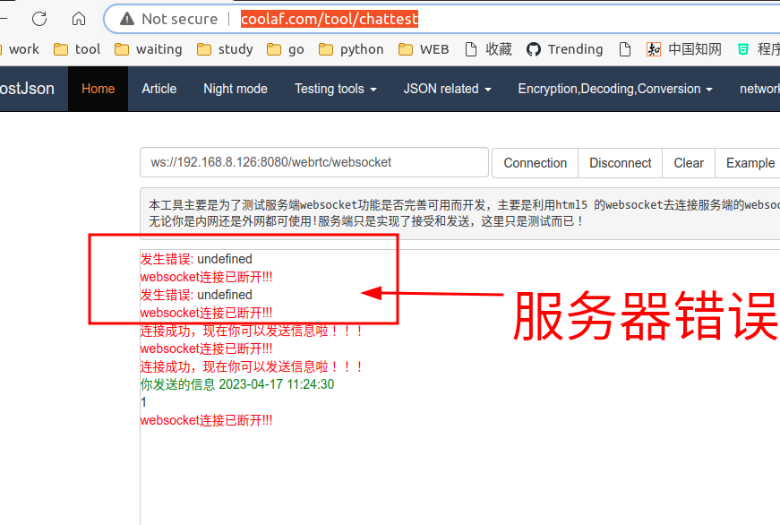

#### Webrtc_Java

进技术交流群，添加微信


webrtc 服务端代码

#### 环境：

```java
IntelliJ IDEA 2020.2.3 (Ultimate Edition)

Tomcat 8.5.45

Jdk 1.8.0_271
```


**war 包路径：**

**[https://github.com/taxiao213/Webrtc_Java/tree/master/war](https://github.com/taxiao213/Webrtc_Java/tree/master/war)**


**websocket 链接：**

**ws://172.19.0.52:8080/webrtc/websocket**


**Android 客户端：**

**[https://github.com/taxiao213/Webrtc_Android](https://github.com/taxiao213/Webrtc_Android)**


#### 启动方式：

##### 1.idea 启动项目

配置maven 路径，下载依赖包，配置好 Tomcat 并启动


###### 1.1 启动


###### 1.2 在线测试


###### 1.3 服务端收到信息


##### 2.创建 war 包 

###### 2.1 war 包放到 tomcat webapps 目录下


###### 2.2 启动 tomcat 


http://coolaf.com/tool/chattest




 

